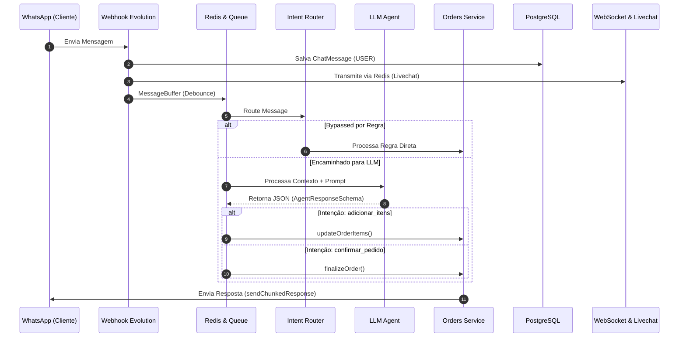

# Ferramentas e Ações da IA (System Tools)

Este documento detalha a arquitetura, o esquema de resposta estruturada e as ferramentas/ações executadas pelo backend a partir do processamento da LLM e das regras de negócio do sistema de atendimento da padaria.

---

## 🏛️ Arquitetura de IA: Saída Estruturada

O sistema utiliza a arquitetura de **Saída Estruturada via JSON Schema** com validação estrita do [Zod](https://zod.dev). Em vez de chamadas de função tradicionais (OpenAI Function Calling com múltiplos roundtrips), a LLM analisa o histórico e o contexto atual da conversa e retorna um objeto JSON estruturado contendo a intenção, dados do cliente, produtos solicitados e a mensagem final.

### Esquema do JSON (`AgentResponseSchema`)

```typescript
export const AgentResponseSchema = z.object({
  intent: z.enum([
    "adicionar_itens",
    "duvida_cardapio",
    "confirmar_pedido",
    "cancelar_pedido",
    "fora_escopo",
    "generico"
  ]),
  customerInfo: z.object({
    name: z.string(),
    address: z.string(),
    payment: z.string(),
  }),
  products: z.array(z.object({
    id: z.string(),
    quantity: z.number(),
    notes: z.string().optional()
  })).optional(),
  message: z.string()
});
```

---

## 🛠️ Lista de Ferramentas e Serviços do Sistema

### 1. `OrdersService.updateOrderItems` (Atualizador de Carrinho e Pedido)
* **Localização**: `src/lib/services/orders.service.ts`
* **Descrição**: Gerencia a adição e atualização de itens no carrinho do cliente.
* **Comportamento**:
  - Mapeia IDs curtos (ex: `1`, `2`) para os UUIDs reais dos produtos.
  - Insere ou incrementa a quantidade de itens no carrinho mantido na sessão no Redis.
  - Recalcula o valor total acumulado do pedido.
  - Se o cliente já possuir um pedido ativo em preparo, altera o pedido no PostgreSQL e notifica o painel Kanban em tempo real via Redis.

### 2. `OrdersService.finalizeOrder` (Gerador de Pedidos no Banco e Kanban)
* **Localização**: `src/lib/services/orders.service.ts`
* **Descrição**: Executada quando a intenção detectada é `confirmar_pedido`.
* **Comportamento**:
  - Valida se os dados de **Endereço** e **Forma de Pagamento** foram preenchidos.
  - Cria um novo registro na tabela `Order` do PostgreSQL com o status `CONFIRMED`.
  - Associa o pedido ativo ao cliente.
  - Publica o evento `ORDER_CREATED` no Redis, inserindo o pedido instantaneamente no painel Kanban da administração.

### 3. `OrdersService.cancelOrder` (Cancelamento de Pedidos)
* **Localização**: `src/app/api/chat/process-bot/route.ts` & `src/lib/services/orders.service.ts`
* **Descrição**: Processa solicitações de cancelamento de pedidos.
* **Comportamento**:
  - Altera o status do pedido ativo no banco de dados para `CANCELLED`.
  - Remove a associação do pedido ativo na tabela `Customer`.
  - Limpa a sessão do cliente no Redis e envia o evento `ORDER_STATUS_UPDATED` para o Kanban.

### 4. `SessionService` & Extrator de Cadastro (`customerInfo`)
* **Localização**: `src/lib/services/session.service.ts`
* **Descrição**: Mantém o estado da conversa e os dados cadastrais do cliente durante o atendimento.
* **Comportamento**:
  - Atualiza continuadamente o **Nome**, **Endereço de Entrega** e **Forma de Pagamento** (`Pix`, `Cartão`, `Dinheiro`).
  - Armazena a sessão com Time-To-Live (TTL) configurável no Redis.
  - Mantém o histórico do contexto da conversa para a LLM.

### 5. `IntentRouter` (Roteador de Regras / Bypass de Tokens)
* **Localização**: `src/lib/bot/intent-router.ts`
* **Descrição**: Sistema de regras determinísticas executado antes da chamada à LLM.
* **Comportamento**:
  - Intercepta atalhos e comandos frequentes (como saudações e regras de negócio diretas).
  - Retorna respostas instantâneas sem gastar tokens da LLM.

### 6. `sendChunkedResponse` (Formatador de Resposta e Envio WhatsApp)
* **Localização**: `src/lib/bot/message-sender.ts`
* **Descrição**: Envia a resposta final gerada pela LLM para o WhatsApp do cliente.
* **Comportamento**:
  - Divide mensagens extensas em blocos amigáveis para leitura no celular.
  - Simula o status "digitando..." (`composing`) via Evolution API.
  - Grava a mensagem na tabela `ChatMessage` e dispara evento WebSocket em tempo real para a interface do Livechat.

### 7. `EvolutionGoService` (Serviço de Comunicação WhatsApp)
* **Localização**: `src/lib/services/evolution-go.ts`
* **Descrição**: Camada de integração HTTP com a API do WhatsApp (Evolution API / Evolution Go).
* **Métodos**:
  - `sendText`: Envia mensagens de texto.
  - `sendPresence`: Atualiza estado de presença (`composing`, `paused`).
  - `sendButtons`: Envia mensagens interativas com botões de resposta rápida (Quick Reply).

---

## 🔄 Fluxo de Processamento de uma Mensagem


